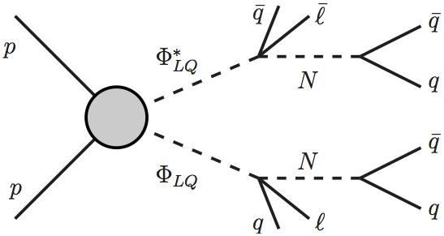

# Composite LeptoQuark UFO model files
This is a repository for the leptoquark model explored in [arXiv:1803.05962](http://arxiv.org/abs/arXiv:1803.05962) by A.Monteux and A.Rajaraman. Please cite the paper if you use this UFO or find this useful.

The UFO file was generated with [FeynRules](http://feynrules.irmp.ucl.ac.be/). The BSM fields and the Lagrangian used as input can be found in [composite_LQ.fr](composite_LQ.fr).


Examples on how to generate events with Madgraph are provided below.

## The model
In this model we introduce composite scalar leptoquarks $S\_1$ and $\tilde{S}\_1$ (in the notation of [Buchmüller, Ruckl, Wyler](http://inspirehep.net/record/235471)), as well as a scalar singlet $N$ and composite scalar color-sextets and octets. The standard leptoquark interaction Lagrangian is

  

to which we add interactions involving the neutral scalar (here and below, all the *G*'s have dimensions of mass<sup>-1</sup>)

  

and interactions of the sextet and octet


Finally, the singlet has an effective coupling to quarks and leptons  
  


## Event Generation
[Download the UFO file here](composite_LQ_UFO.tgz), and untar it in your mg5\_aMC/models directory.

##### Definitions and defaults

We have translated the lagrangians in FeynRules to generate a UFO file, keeping the names and symbols of parameters as close as possible to the nomenclature above. (parameters with a \~ have a `t` in front of their names, e.g. $\tilde{S}\_1$->`tS1`, $\tilde G$->`tG`).

| field |  |  |  |  |  | 
|:---:|:---:|:---:|:---:|:---:|:---:|:---:|:---:|
| quantum numbers | (**3**,**1**,-1/3) | (**3**,**1**,4/3) | (**1**,**1**,0) | (**6**,**1**,-2/3) | (**3**,**1**,-8/3) | (**8**,**1**,0)
| mg5 name| S1b | tS1b | nn | six | tsix | oct
| PID | 9000010 | 9000011| 9000050 | 9000060 | 9000061 | 9000080 |

By default the leptoquarks are at 600 GeV, the sextet and octet at 1500 GeV, and the singlet scalar at 100 GeV.

Most couplings in the Lagrangian above are set to zero, apart from the entries that allow decays with c,tau or b,mu (which were the final states we were interested in the paper). For simplicity the defaults have all LH couplings set to zero and only turned on the RH couplings.

In particular, the only non-zero entries are the 23 components of the *g,G* matrices, the 32 components of *tg,tG*s, as well as *gNu*<sub>2</sub> and *gNd*<sub>3</sub>. Defaults are 1 for all non-zero dimensionless couplings, 1000 GeV (or 0.001 GeV<sup>-1</sup>) for non-zero dimensionful couplings.


### All Tests
All processes used in our paper are present in [composite\_LQ\_test.mg5](composite_LQ_test.mg5) and can be generated at once by running

```
bin/mg5_amc  composite_LQ_test.mg5
```

For completeness, we also list each process below.

#### Leptoquark production and decay
The simplest process is leptoquark pair-production, followed by decays. One can either write the whole process in Madgraph, or only produce the leptoquarks and let Pythia handle the decays (the latter is considerably faster, especially with the many final states present). For Pythia to know how to decay the new particles, we use `compute_widths` in Madgraph to calculate **all** the branching ratios.



The following will produce the leptoquark $S_1$, and prepare the decay chain with c-tau, as depicted.


```
import model composite_LQ_UFO
generate p p > s1b s1b~
output lqlq_ccctau
launch
 set nevents 100
 set g1r2x3 0
 set gnnd3 0
 set gnnu2 1
 compute_widths s1b
 compute_widths nn
 done

```


The following will produce the leptoquark $\tilde{S}_1$ and prepare the decay chain with b-mu, as depicted.

```
import model composite_LQ_UFO
generate p p > ts1b ts1b~
output lqlq_bbbmu
launch
 set nevents 100
 set gt1r3x2 0
 set gnnu2 0
 set gnnd3 1
 compute_widths ts1b
 compute_widths nn
 done
```

#### Sextet production

The color sextet scalar can be pair-produced and then decay to two leptoquarks each, followed by the same decay chain as in the previous examples.

```
import model composite_LQ_UFO
generate p p > six six~
output lq_sixsix_ccctau
launch
 set nevents 100
 set g1r2x3 0
 set gnnd3 0
 set gnnu2 1
 compute_widths six
 compute_widths s1b
 compute_widths nn
 done
```

```
import model composite_LQ_UFO
generate p p > tsix tsix~
output lq_sixsix_bbbmu
launch
 set nevents 100
 set gt1r3x2 0
 set gnnu2 0
 set gnnd3 1
 compute_widths tsix
 compute_widths ts1b
 compute_widths nn
 done

```

#### Octet production

Finally we pair-produce the octet, each of which will decay to a quark, a lepton and a leptoquark. The two runs below will generate events with c-tau and b-mu final states.

```
import model composite_LQ_UFO
generate p p > oct  oct
output lq_octoct
launch
 set nevents 100
 set GtS8r3x2 0
 set GS8r2x3 0.001
 set g1r2x3 0
 set gnnd3 0
 set gnnu2 1
 compute_widths 9000080
 compute_widths s1b
 compute_widths nn
 done

launch
 set nevents 100
 set GS8r2x3 0
 set GtS8r3x2 0.001
 set gt1r3x2 0
 set gnnu2 0
 set gnnd3 1
 compute_widths 9000080
 compute_widths ts1b
 compute_widths nn
 done
```

That's it!